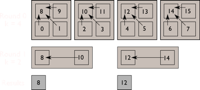

DIY supports general reductions to implement complex global operations over blocks.  These reductions are
general-purpose (any global communication pattern can be implemented); they operate over blocks, which cycle in and
out-of-core as necessary; the operations are (multi-)threaded automatically using the same mechanism as `foreach()`.

All the reductions included in DIY
operate in rounds over a k-ary reduction tree. The value of k used in each round can vary, but if it's fixed, the number
of rounds is log_k(nblocks). In each round of the reduction tree, the distance between blocks (in terms of their block
global ID or `gid`) either increases (so-called "distance-doubling") or decreases (so-called "distance-halving"). This
is controlled by the `contiguous` argument, which defaults to `true` (distance-doubling).
Only blocks decomposed by a `diy::RegularDecomposer` (i.e., blocks arranged in a regular block grid) can be reduced this
way. The decomposer object is one of the arguments to the reduction.

The following patterns are currently available. With the exception of `all_to_all`, the other patterns all feature a
call to `diy::reduce`, passing a derived class of `diy::RegularPartners` to differentiate between the different
patterns. The callback function passed to `diy::reduce` is similar to the callback function used with
`diy::Master:foreach` described in the [Callbacks page](callbacks.md). The callback function is called by DIY in each
round of the reduction tree. Each time, the communication proxy (`ReduceProxy`) acts similarly as in `foreach`: the
proxy contains the neighboring blocks that form a communicating group for the current round. Unlike `foreach`, this
group changes from one round to the next in a reduction. In addition to a pointer to the block and the communication
proxy, the callback is given the partners class, which can provide additional information. The user needs to write the
body of the callback function, which typically dequeues received messages from the previous round, performs some local
computation, and enqeues messages for the next round.

## Merge-reduce

A merge-reduce accumulates information in successively fewer blocks with each round. Each round, one block in a
communicating group (`ReduceProxy`) takes ownership of the merged result and continues to the next round, while the other
blocks in the group idle in the following rounds. In the final round, one block, the root of the reduction tree,
has all of the data.

<!---
The figure below illustrates the first two rounds of a reduction of 16 blocks. The first round uses radix 4 while the
second round uses radix 2.

--->

~~~~{.cpp}
void foo(Block* b,                                  // local block
         const diy::ReduceProxy& rp,                // communication proxy
         const diy::RegularMergePartners&)          // partners of the current block
{
    // dequeue and merge
    for (int i = 0; i < rp.in_link().size(); ++i)
    {
        int nbr_gid = rp.in_link().target(i).gid;
        std::vector<int>    in_vals;
        rp.dequeue(nbr_gid, in_vals);

        // merge with current block data, e.g., accumulate sum
        for (size_t j = 0; j < in_vals.size(); ++j)
            (b->data)[j] += in_vals[j];
    }

    // step 2: enqueue
    for (int i = 0; i < rp.out_link().size(); ++i)    // redundant since out_link size = 1 for merge-reduce
        rp.enqueue(rp.out_link().target(i), b->data);
}

int main(int argc, char* argv[])
{
    ...
    int k = 2;                                       // the radix of the k-ary reduction tree

    // partners for merge over regular block grid
    diy::RegularMergePartners  partners(decomposer,  // diy::Decomposer object
                                        k,           // radix of k-ary reduction (default 2)
                                        contiguous); // contiguous = true: distance doubling (default true)
                                                     // contiguous = false: distance halving

    // reduction
    diy::reduce(master,                              // diy::Master object
                assigner,                            // diy::Assigner object
                partners,                            // diy::RegularMergePartners object
                &foo);                               // merge operator callback function
    ...
}
~~~~

[see the example here](https://github.com/diatomic/diy/blob/master/examples/reduce/merge-reduce.cpp)

## Broadcast

A broadcast is implemented as a merge-reduce in reverse order. Starting with one block, each round features more blocks
participating in the communication. The usage is similar to merge-reduce, with the partners object now being
`diy::RegularBroadcastPartners'.

~~~~{.cpp}
void foo(Block* b,                                      // local block
         const diy::ReduceProxy& rp,                    // communication proxy
         const diy::RegularBroadcastPartners&);         // partners of the current block

int main(int argc, char* argv[])
{
    ...
    // partners for broadcast over regular block grid
    diy::RegularBroadcastPartners partners(decomposer,  // diy::Decomposer object
                                           k,           // radix of k-ary reduction (default 2)
                                           contiguous); // contiguous = true: distance doubling (default true)
                                                        // contiguous = false: distance halving

    // reduction
    diy::reduce(master,                                 // diy::Master object
                assigner,                               // diy::Assigner object
                partners,                               // diy::RegularBroadcastPartners object
                &foo);                                  // broadcast operator callback function
    ...
}
~~~~

## Swap-reduce

Unlike a merge-reduce, the idea of a swap-reduce is to keep all blocks busy in all rounds. Typically data are
split and swapped among the neighboring blocks in each round, but the actual operations performed
are up to the user to write in the callback function. DIY's role in the swap-reduce is to provide different neighbors in
each round to the callback function, and to keep all blocks participating in all rounds. The usage is similar to
the the prior examples, with `diy::RegularSwapPartners` being used for the partners object.

<!---
The figure below illustrates the first two rounds of a reduction of 16 blocks. The first round uses radix 4 while the
second round uses radix 2.

--->

~~~~{.cpp}
void foo(Block* b,                                  // local block
         const diy::ReduceProxy& rp,                // communication proxy
         const diy::RegularSwapPartners&);          // partners of the current block

int main(int argc, char* argv[])
{
    ...
    // partners for swap over regular block grid
    diy::RegularSwapPartners   partners(decomposer,  // diy::Decomposer object
                                        k,           // radix of k-ary reduction (default 2)
                                        contiguous); // contiguous = true: distance doubling (default true)
                                                     // contiguous = false: distance halving

    // reduction
    diy::reduce(master,                              // diy::Master object
                assigner,                            // diy::Assigner object
                partners,                            // diy::RegularSwapPartners object
                &foo);                               // swap operator callback function
    ...
}
~~~~

[see the example here](https://github.com/diatomic/diy/blob/master/examples/reduce/swap-reduce.cpp)

## All-reduce

An all-reduce is a merge-reduce followed by a broadcast of the result from the root block to all of the
blocks, so that all blocks have the same result. The same usage follows from the previous examples, only changing the
partners object. Usage is similar to the previous examples, with the partners class now being
`diy::RegularAllReducePartners`.

~~~~{.cpp}
void foo(Block* b,                                      // local block
         const diy::ReduceProxy& rp,                    // communication proxy
         const diy::RegularAllReducePartners&);         // partners of the current block

int main(int argc, char* argv[])
{
    ...
    // partners for all-reduce over regular block grid
    diy::RegularAllReducePartners partners(decomposer,  // diy::Decomposer object
                                           k,           // radix of k-ary reduction (default 2)
                                           contiguous); // contiguous = true: distance doubling (default true)
                                                        // contiguous = false: distance halving

    // reduction
    diy::reduce(master,                                 // diy::Master object
                assigner,                               // diy::Assigner object
                partners,                               // diy::RegularAllReducePartners object
                &foo);                                  // all-reduce operator callback function
    ...
}
~~~~

## All-to-all

The previous examples followed a common pattern. All-to-all is the exception. In an all-to-all reduction, each
block sends and receives from every other block. Even though all-to-all is implemented with a
reduction tree, it is called as if there were a single round of direct communication between all blocks.
This means there is no partners object, and the callback function is written as if there were a
single round with access to all blocks through the `ReduceProxy`. However, the radix `k` of the k-ary underlying
implementation is still supplied (defaults to 2).

~~~~{.cpp}
void foo(Block* b,                                          // local block
         const diy::ReduceProxy& rp)                        // communication proxy
{
    // outgoing
    if (rp.in_link().size() == 0)
    {
        // enqueue data to the correct blocks
        int dest_gid = ...                                  // destination block global ID
        diy::BlockID dest = rp.out_link().target(dest_gid); // need a full BlockID; out_link targets are ordered as gids
        rp.enqueue(dest, value);
    }
    // incoming
    else
    {
        for (int i = 0; i < rp.in_link().size(); ++i)
        {
            int gid = rp.in_link().target(i).gid;
            diy::MemoryBuffer& incoming = rp.incoming(gid);
            // copy incoming to the block
            ...
        }
    }
}

int main(int argc, char* argv[])
{
    ...
    diy::all_to_all(master,                                 // diy::Master object
                    assigner,                               // diy::Assigner object
                    &foo,                                   // all-to-all operator callback function
                    k);                                     // radix of k-ary underlying implementation (default 2)
    ...
}
~~~~

[see the example here](https://github.com/diatomic/diy/blob/master/examples/reduce/all-to-all.cpp)

